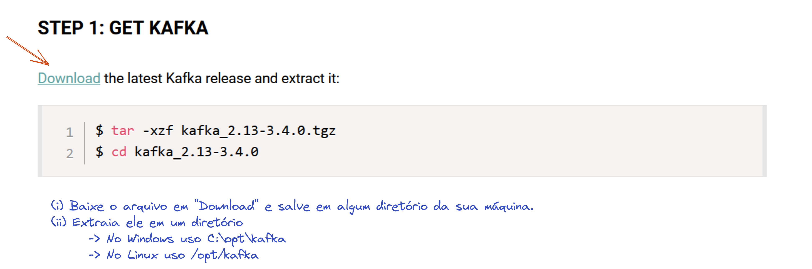

# 1. Como configurar um Broker Apache Kafka

[Voltar](./README.md) [Próximo](./02-criando-um-produtor.md)

## Objetivo

* Criar um broker Apache Kafka
* Entender quais são as principais configurações para o broker
* Entender do que depende o broker

## Roteiro

### 1.1. Fazendo download

Nesse primeiro passo vamos acessar a página [kafka.apache.org/quickstart](https://kafka.apache.org/quickstart) e fazer o download da última versão do Kafka.


Fonte: https://excalidraw.com/#json=g55h35EziE3ur0dJ46zij,JZeelCEm8Zka0AKCPK-Fcw

```bash
curl https://dlcdn.apache.org/kafka/3.4.0/kafka_2.13-3.4.0.tgz -o kafka_2.13-3.4.0.tgz
tar zxvf kafka_2.13-3.4.0.tgz
mv kafka_2.13-3.4.0 /opt/kafka
cd /opt/kafka
```

Esse arquivo contém os executáveis e exemplos de arquivo de configuração para quaisquer instalações. Abaixo observamos que no diretório `/opt/kafka/bin` tem vários scripts que são úteis tanto no ambiente de desenvolvimento quando de produção e em `/opt/kafka/config` exemplos de arquivos de configuração.

```bash
$ ls /opt/kafka/
LICENSE  NOTICE  bin/  config/  libs/  licenses/  site-docs/

$ ls /opt/kafka/bin/
connect-distributed.sh*        kafka-mirror-maker.sh*
connect-mirror-maker.sh*       kafka-producer-perf-test.sh*
connect-standalone.sh*         kafka-reassign-partitions.sh*
kafka-acls.sh*                 kafka-replica-verification.sh*
kafka-broker-api-versions.sh*  kafka-run-class.sh*
kafka-cluster.sh*              kafka-server-start.sh*
kafka-configs.sh*              kafka-server-stop.sh*
kafka-console-consumer.sh*     kafka-storage.sh*
kafka-console-producer.sh*     kafka-streams-application-reset.sh*
kafka-consumer-groups.sh*      kafka-topics.sh*
kafka-consumer-perf-test.sh*   kafka-transactions.sh*
kafka-delegation-tokens.sh*    kafka-verifiable-consumer.sh*
kafka-delete-records.sh*       kafka-verifiable-producer.sh*
kafka-dump-log.sh*             trogdor.sh*
kafka-features.sh*             windows/
kafka-get-offsets.sh*          zookeeper-security-migration.sh*
kafka-leader-election.sh*      zookeeper-server-start.sh*
kafka-log-dirs.sh*             zookeeper-server-stop.sh*
kafka-metadata-quorum.sh*      zookeeper-shell.sh*
kafka-metadata-shell.sh*

$ ls /opt/kafka/config/
connect-console-sink.properties    consumer.properties
connect-console-source.properties  kraft/
connect-distributed.properties     log4j.properties
connect-file-sink.properties       producer.properties
connect-file-source.properties     server.properties
connect-log4j.properties           tools-log4j.properties
connect-mirror-maker.properties    trogdor.conf
connect-standalone.properties      zookeeper.properties

```

### 1.2. Dependências

Para rodar localmente é preciso ter a versão 8 do OpenJDK

```bash
apt install openjdk-8-jdk
```

### 1.3. Executando o Kafka: Zookeeper or not Zookeeper

Inicialmente muitas das funcionalidades do Kafka era implementadas usando o Zookeeper. Zookeeper é um serviço usado para eleição do líder, configurações de tópicos, controle de acesso e de membros do clusters. O processo de remoção de da dependência do Zookeeper vem acontecendo desde a versão 2.8, para que não exista essa dependência foi implementada uma versão do protocolo de consenso [Raft](https://raft.github.io/) usando apenas Apache Kafka, o [KRaft](https://cwiki.apache.org/confluence/display/KAFKA/KIP-595%3A+A+Raft+Protocol+for+the+Metadata+Quorum).

Na versão 3.4 já temos acesso a implementação do KRaft, mas ainda vemos na documentação formas de se iniciar o Kafka usando o Zookeeper porque no cronograma foi priorizada a implementação do KRaft sem priorizar a migração dos dados que estão no Zookeeper. Hoje não há implementada uma migração dos dados que estão no Zookeeper para o Kafka, mas até a versão 4 estará disponível.

Para iniciar o Kafka com o Zookeeper, execute os dois comandos abaixo:

```bash
./bin/zookeeper-server-start.sh ./config/zookeeper.properties
```

```bash
./bin/kafka-server-start.sh ./config/server.properties
```

Usamos as configurações padrão já disponibilizada no pacote do Kafka, mas vamos ver quais são os parâmetros importantes?

Para o Zookeeper temos apenas `clientPort=2181` a porta definida e o diretório `dataDir=/tmp/zookeeper`. Essas configurações são importante para rodar somente uma instância, caso seja preciso criar um cluster Zookeeper é preciso também configurar onde estão as outras instâncias do Zookeeper. Observe o exemplo abaixo da [documentação do Zookeeper](https://zookeeper.apache.org/doc/current/zookeeperStarted.html):

```
tickTime=2000
dataDir=/var/lib/zookeeper
clientPort=2181
initLimit=5
syncLimit=2
server.1=zoo1:2888:3888
server.2=zoo2:2888:3888
server.3=zoo3:2888:3888
```

Se você está usando Docker ou Kubernetes é importante garantir a persistência do diretório `dataDir`, senão haverá perda de dados importantes!

Para o Kafka temos outras configurações importantes e algumas serão entendidas mais adiante.

```
broker.id=0
listeners=PLAINTEXT://:9092
advertised.listeners=PLAINTEXT://your.host.name:9092
log.dirs=/tmp/kafka-logs
zookeeper.connect=localhost:2181
```

O `broker.id` é a identificação do broker no cluster. Cada broker deve ter um identificador único, preferencialmente um inteiro sequencial.

Já os valores `listeners` e `advertised.listeners` vão definir a porta e a maneira como o seu cluster será encontrado. Como temos um cluster, nem sempre o cliente se conecta com todos os brokers e a conexão é comutada entre os brokers. Quando for necessário mudar de conexão, a biblioteca usará o valor de `advertised.listeners` para abrir uma nova conexão com o broker.

Todos os dados do cluster serão armazenados dentro de `log.dirs`. É muito importante não confundir esse diretório com os logs de execução da aplicação, todos os dados do Kafka são armazenados em arquivos logs, ou seja arquivos sequenciais.

E por fim temos o `zookeeper.connect` que define qual cluster Zookeeper usar para fazer a sincronia entre todos os brokers do cluster Kafka.


Fonte: https://excalidraw.com/#json=dKMumrKAZXEUiV9vi69AO,OKbSR7kL31U4FtyhCfHX9w


Para iniciar o Kafka usando KRaf, execute o comando abaixo:

```bash
$ ./bin/kafka-storage.sh random-uuid
ng-isO0fQVeaSar4Fp9u8A

$ ./bin/kafka-storage.sh format -t ng-isO0fQVeaSar4Fp9u8A -c ./config/kraft/server.properties
Formatting /tmp/kraft-combined-logs with metadata.version 3.4-IV0.

$ ./bin/kafka-server-start.sh ./config/kraft/server.properties
[2023-04-03 00:40:29,837] INFO Registered kafka:type=kafka.Log4jController MBean (kafka.utils.Log4jControllerRegistration$)
...
[2023-04-03 00:40:35,694] INFO [BrokerServer id=1] Transition from STARTING to STARTED (kafka.server.BrokerServer)
[2023-04-03 00:40:35,696] INFO Kafka version: 3.4.0 (org.apache.kafka.common.utils.AppInfoParser)
[2023-04-03 00:40:35,696] INFO Kafka commitId: 2e1947d240607d53 (org.apache.kafka.common.utils.AppInfoParser)
[2023-04-03 00:40:35,697] INFO Kafka startTimeMs: 1680482435694 (org.apache.kafka.common.utils.AppInfoParser)
[2023-04-03 00:40:35,699] INFO [KafkaRaftServer nodeId=1] Kafka Server started (kafka.server.KafkaRaftServer)   
```

Para usar o KRaft precisamos mudar apenas uma configuração, ao invés de usar `zookeeper.connect` passamos a usar `controller.quorum.voters` que deve listar um conjunto de brokers acompanhado do seu respectivo id. 

```
controller.quorum.voters=1@kafka-1:9092,2@kafka-2:9092,3@kafka-2:9092
```

### 1.4. Demais propriedades

Todas as propriedades aceitas pelo pelo broker estão definidas na [documentação do Kafka](https://kafka.apache.org/documentation/#brokerconfigs), ver sessão Configuration → Broker Config. Recomendo depois a leitura detalhada para melhor conhecimento. Abaixo listo as mais importantes e o motivo.

* auto.create.topics.enable
* delete.topic.enable
* background.threads
* log.retention.*
* log.roll.*
* log.segment.*
* min.insync.replicas
* num.io.threads
* num.network.threads
* num.recovery.threads.per.data.dir
* num.partitions
* default.replication.factor
* offsets.retention

[Voltar](./README.md) [Próximo](./02-criando-um-produtor.md)