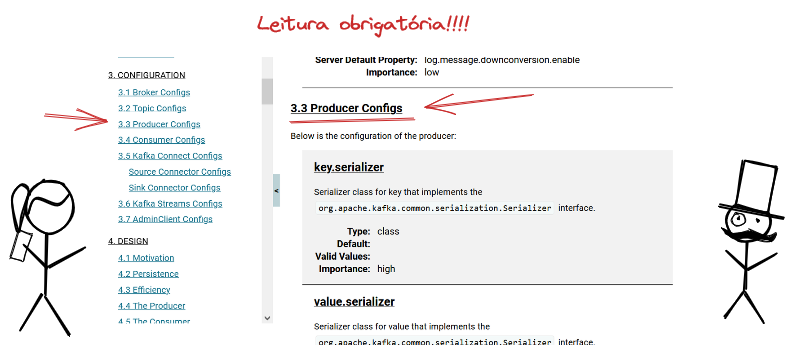

# 2. Como criar um Produtor de Mensagens

[Voltar](./01-configurar-broker-kafka.md) [Próximo](./03-criando-um-consumidor.md)


# 2.1. Criando um projeto Java e configurando as bibliotecas necessárias

Para criar o projeto Java, vamos usar o Maven para gerenciar dependências e automatizar a build. O projeto já está criado ([ver](./produtor/meu-primeiro-produtor)).

Caso você não tenha experiência em Maven, é um dos gerenciadores de build mais famosos do Java. Recomendo a leitura de uma introdução que escrevi para projetos Quarkus [Maven 101](https://github.com/dev-roadmap/backend-roadmap/blob/main/caso-de-uso-00-configurando-um-projeto-quarkus.md#maven-101) ou de uma série completa de posts do Chandra Guntur [Understanding Apache Maven – The Series](https://cguntur.me/2020/05/20/understanding-apache-maven-the-series/) (em inglês).

Para gerar um projeto Maven, use o comando abaixo.

```bash
mvn archetype:generate -DgroupId=io.vepo.kafka.imersao -DartifactId=meu-primeiro-produtor -DarchetypeArtifactId=maven-archetype-quickstart -DarchetypeVersion=1.4 -DinteractiveMode=false
```

Depois de criado o projeto, abra o arquivo _Project Object Model_ `pom.xml` e adicione a biblioteca na área de dependências. As dependências Maven são representadas pelas coordenadas (`groupId`, `artifactId` e `version`) e podem ser encontrada nos repositórios [sonartype](https://central.sonatype.com/artifact/org.apache.kafka/kafka-clients/3.4.0/overview) ou [mvnrepository](https://mvnrepository.com/artifact/org.apache.kafka/kafka-clients/3.4.0).

```xml
<dependency>
    <groupId>org.apache.kafka</groupId>
    <artifactId>kafka-clients</artifactId>
    <version>3.4.0</version>
</dependency>
```

> **_Sobre o arquétipo:_** O arquétipo do projeto Java é bem antigo e desatualizado. Pode remover a dependência do JUnit 4 e mudar a versão do Java de `1.7` para `1.8`.
>
> **_Sobre a versão do Java:_**: As bibliotecas do Apache Kafka são compatíveis com as novas versões do Java, mas usaremos a 8. Se quiser pode testar depois como fica nas versões 11 (LTS), 17 (LTS) e 20 (mais recente).

# 2.2. Criando a classe produtora e informando o Maven que ela deve ser executada

O Maven segue a filosofia **convenção-sobre-configuração**, ou seja, para criar uma classe não precisamos informar em lugar nenhum que ela deve ser compilada, deve-se apenas colocar ela no diretório correto.

Nosso exemplo será um Produtor de informações climáticas, por isso vou criar a classe `WeatherSensorCollector`, ela vai pertencer ao pacote `io.vepo.sensor.weather`, logo deve ser colocada na estrutura abaixo:

```
.
├── src                      ## Todo o código deve ser armazenado nessa pasta
│   ├── main                 ## Código de produção
|   |   ├── java             ## Código Java de produção
|   |   |   └── io
|   |   |       └── vepo
|   |   |           └── sensor
|   |   |               └── weather
|   |   |                   └── WeatherSensorCollector.java
|   |   └── resources        ## Arquivos que não serão compilados, mas estarão disponíveis em tempo de execução
│   └── test                 ## Código usado para testes unitários
|       ├── java             ## Código Java para testes unitários
|       └── resources        ## Arquivos que não serão compilados, mas estarão disponíveis em tempo de execução
└── pom.xml                  ## Arquivo que define como será feita a build
```

Criada a classe, podemos verificar se está tudo certo executando ela usando o Maven:

```bash
mvn clean compile exec:java -Dexec.mainClass=io.vepo.sensor.weather.WeatherSensorCollector
```

Para facilitar nossa vida, vamos adicionar definir a classe principal direto no jar e como configuração padrão para execução.

Adicione o seguinte plugin (procure por `build` → `plugins` ou `build` → `pluginManagement` → `plugins`) para configurar a build:

```xml
<plugin>
    <groupId>org.codehaus.mojo</groupId>
    <artifactId>exec-maven-plugin</artifactId>
    <version>3.1.0</version>
    <configuration>
        <mainClass>io.vepo.sensor.weather.WeatherSensorCollector</mainClass>
    </configuration>
</plugin>
```

Agora para executar, basta usar:

```bash
mvn clean compile exec:java
```

Para definir que essa classe de execução do jar, altere a configuração do plugin `maven-jar-plugin`:

```xml
<plugin>
    <artifactId>maven-jar-plugin</artifactId>
    <version>3.0.2</version>
    <configuration>
        <archive>
            <manifest>
                <addClasspath>true</addClasspath>
                <mainClass>io.vepo.sensor.weather.WeatherSensorCollector</mainClass>
            </manifest>
        </archive>
    </configuration>
</plugin>
```

Para executar é preciso primeiro criar o jar:

```bash
mvn clean package
java -jar target/meu-primeiro-produtor-1.0-SNAPSHOT.jar
```

# 2.3. Implementando o Produtor

Antes de implementar essa classe, vamos criar alguns pressupostos sobre como ela vai ser utilizada.

1. Ela será utilizada em um loop de coleta dedados. Ela deve ser passada inicializada para o loop.
2. Ela receberá um objeto com informações do clima.
3. A chave será a geolocalização e esse valor está dentro das informações do clima.
4. A classe já receberá o produtor inicializado.

```java
WeatherSensorCollector collector = new WeatherSensorCollector(new KafkaProducer<>(/* inicialização */));
collector.send(new WeatherInfo(/* inicialização */));
```

# 2.3.1. Implementando os Serializers

O primeiro passo quando vamos pensa em um produtor é escolher nossos Serializador. Devemos escolher o serializador dos valores e das chaves. A biblioteca padrão do Kafka já vem com alguns serializadores, mas eles se resumem a tipos primitivos e objetos simples. O recomendado é que usemos um serializador open source, como o da Confluent ou da Red Hat, mas para estudo vamos implementar nosso próprio.

Todo serializador deve implementar a interface [Serializer](https://kafka.apache.org/34/javadoc/org/apache/kafka/common/serialization/Serializer.html), [código da biblioteca padrão é aberto](https://github.com/apache/kafka/blob/trunk/clients/src/main/java/org/apache/kafka/common/serialization/Serializer.java) e podemos ver que são disponibilizado serializadores para `boolean` ([**BooleanSerializer**](https://github.com/apache/kafka/blob/trunk/clients/src/main/java/org/apache/kafka/common/serialization/BooleanSerializer.java)), `byte[]` ([**ByteArraySerializer**](https://github.com/apache/kafka/blob/trunk/clients/src/main/java/org/apache/kafka/common/serialization/ByteArraySerializer.java)), `ByteBuffer` ([**ByteBufferSerializer**](https://github.com/apache/kafka/blob/trunk/clients/src/main/java/org/apache/kafka/common/serialization/ByteBufferSerializer.java)), `Bytes` (um tipo de byte[] imutável do Kafka, [**BytesSerializer**](https://github.com/apache/kafka/blob/trunk/clients/src/main/java/org/apache/kafka/common/serialization/BytesSerializer.java)), `double` ([**DoubleSerializer**](https://github.com/apache/kafka/blob/trunk/clients/src/main/java/org/apache/kafka/common/serialization/DoubleSerializer.java)), `float` ([**FloatSerializer**](https://github.com/apache/kafka/blob/trunk/clients/src/main/java/org/apache/kafka/common/serialization/FloatSerializer.java)), `int` ([**IntegerSerializer**](https://github.com/apache/kafka/blob/trunk/clients/src/main/java/org/apache/kafka/common/serialization/IntegerSerializer.java)), `long` ([**LongSerializer**](https://github.com/apache/kafka/blob/trunk/clients/src/main/java/org/apache/kafka/common/serialization/LongSerializer.java)), `short` ([**ShortSerializer**](https://github.com/apache/kafka/blob/trunk/clients/src/main/java/org/apache/kafka/common/serialization/ShortSerializer.java)), `String` ([**StringSerializer**](https://github.com/apache/kafka/blob/trunk/clients/src/main/java/org/apache/kafka/common/serialization/StringSerializer.java)), `UUID` ([**UUIDSerializer**](https://github.com/apache/kafka/blob/trunk/clients/src/main/java/org/apache/kafka/common/serialization/UUIDSerializer.java)) e `null` ([**VoidSerializer**](https://github.com/apache/kafka/blob/trunk/clients/src/main/java/org/apache/kafka/common/serialization/VoidSerializer.java)).

As bibliotecas de serialização vão depender de Schema, que falaremos depois. Pela [Confluent](https://docs.confluent.io/platform/current/schema-registry/fundamentals/serdes-develop/index.html#supported-formats) temos o [**KafkaAvroSerializer**](https://github.com/confluentinc/schema-registry/blob/master/avro-serializer/src/main/java/io/confluent/kafka/serializers/KafkaAvroSerializer.java) para [AVRO](https://avro.apache.org/docs/1.11.1/specification/), [**KafkaProtobufSerializer**](https://github.com/confluentinc/schema-registry/blob/master/protobuf-serializer/src/main/java/io/confluent/kafka/serializers/protobuf/KafkaProtobufSerializer.java) para [ProtoBuf](https://protobuf.dev/programming-guides/proto3/) e [**KafkaJsonSchemaSerializer**](https://github.com/confluentinc/schema-registry/blob/master/json-schema-serializer/src/main/java/io/confluent/kafka/serializers/json/KafkaJsonSchemaSerializer.java) para [JSON](https://www.json.org/json-en.html). Pela [Red Hat](https://www.apicur.io/registry/docs/apicurio-registry/2.4.x/getting-started/assembly-configuring-kafka-client-serdes.html), temos o [**AvroKafkaSerializer**](https://github.com/Apicurio/apicurio-registry/blob/main/serdes/avro-serde/src/main/java/io/apicurio/registry/serde/avro/AvroKafkaSerializer.java) para [AVRO](https://avro.apache.org/docs/1.11.1/specification/) e [**ProtobufKafkaSerializer**](https://github.com/Apicurio/apicurio-registry/blob/main/serdes/protobuf-serde/src/main/java/io/apicurio/registry/serde/protobuf/ProtobufKafkaSerializer.java) para [ProtoBuf](https://protobuf.dev/programming-guides/proto3/). Esses formatos dependem da troca de Schema entre o produtor e o consumidor, o que implica no uso de um servidor de registro de schemas, que são o [Schema Registry](https://docs.confluent.io/platform/current/schema-registry/index.html#about-sr) da Confluent e o [Apicurio Registry](https://www.apicur.io/registry/docs/apicurio-registry/2.4.x/index.html) da Red Hat.


Podemos ver abaixo o código da interface Serializer. Devemos implementar o método `byte[] serialize(String topic, T data);` e apesar de existir o um método com o argumento `Headers` ele não faz parte do corpo da mensagem e falaremos mais a frente.

```java
/**
 * An interface for converting objects to bytes.
 *
 * A class that implements this interface is expected to have a constructor with no parameter.
 * <p>
 * Implement {@link org.apache.kafka.common.ClusterResourceListener} to receive cluster metadata once it's available. Please see the class documentation for ClusterResourceListener for more information.
 *
 * @param <T> Type to be serialized from.
 */
public interface Serializer<T> extends Closeable {

    /**
     * Configure this class.
     * @param configs configs in key/value pairs
     * @param isKey whether is for key or value
     */
    default void configure(Map<String, ?> configs, boolean isKey) {
        // intentionally left blank
    }

    /**
     * Convert {@code data} into a byte array.
     *
     * @param topic topic associated with data
     * @param data typed data
     * @return serialized bytes
     */
    byte[] serialize(String topic, T data);

    /**
     * Convert {@code data} into a byte array.
     *
     * @param topic topic associated with data
     * @param headers headers associated with the record
     * @param data typed data
     * @return serialized bytes
     */
    default byte[] serialize(String topic, Headers headers, T data) {
        return serialize(topic, data);
    }

    /**
     * Close this serializer.
     * <p>
     * This method must be idempotent as it may be called multiple times.
     */
    @Override
    default void close() {
        // intentionally left blank
    }
}
```


Vamos optar por uma solução simples usando [`ByteBuffer`](https://docs.oracle.com/javase/8/docs/api/java/nio/ByteBuffer.html) para serializar nossos objetos de domínio. Segue abaixo como ficaria a implementação.

```java
public class WeatherInfoSerializer implements Serializer<WeatherInfo> {

    @Override
    public byte[] serialize(String topic, WeatherInfo data) {
        return ByteBuffer.allocate(Double.SIZE * 4 + Long.SIZE)
                         .putDouble(data.getLocation().getLat())
                         .putDouble(data.getLocation().getLon())
                         .putDouble(data.getTemperature())
                         .putDouble(data.getWind())
                         .putLong(data.getTimestamp())
                         .array();
    }

}
```

```java
public class GeolocationSerializer implements Serializer<Geolocation> {

    @Override
    public byte[] serialize(String topic, Geolocation data) {
        return ByteBuffer.allocate(Double.SIZE * 2)
                         .putDouble(data.getLat())
                         .putDouble(data.getLon())
                         .array();
    }

}
```

# 2.3.2. Definindo as configurações

O próximo passo é definir as configurações do Produtor. Quando vamos inicializar qualquer cliente Kafka, ele pode receber como parâmetro um [**Properties**](https://docs.oracle.com/javase/8/docs/api/java/util/Properties.html) ou um **Map<String, Object>** com os valores que serão usados para configurar o produtor e tudo relacionado a ele (serializers, interceptors, etc...). Os valores aceitos como padrão estão na [documentação do site do Kafka](https://kafka.apache.org/documentation/#producerconfigs), é uma leitura obrigatória. 



Fonte: https://excalidraw.com/#json=vlNnnnJ2VLzXJ7f9swNxk,Qt0njPi8iUSA2MQdAmGV5w

Abaixo eu listo as configurações mais importantes, mas você não precisa decorar essas chaves, pode usar a classe [**ProducerConfig**](https://kafka.apache.org/34/javadoc/org/apache/kafka/clients/producer/ProducerConfig.html) que além de ter toda as chaves, tem toda a documentação associada a ela.

* `key.serializer`
* `value.serializer`
* `bootstrap.servers`
* `partitioner.class`
* `acks`
* `interceptor.classes`

Assim para definir as propriedades que vamos usar basta:

```java
Properties properties = new Properties();
properties.put(ProducerConfig.BOOTSTRAP_SERVERS_CONFIG, "localhost:9092");
properties.put(ProducerConfig.KEY_SERIALIZER_CLASS_CONFIG, GeolocationSerializer.class);
properties.put(ProducerConfig.VALUE_SERIALIZER_CLASS_CONFIG, WeatherInfoSerializer.class);
```

# 2.3.3. Instanciando e usando o Produtor

Agora precisamos definir a classe que vai encapsular o produtor. As responsabilidades dela serão:

* Definir o Tópico
* Definir a chave

```java
public class WeatherSensorCollector implements AutoCloseable {

    private final Producer<Geolocation, WeatherInfo> producer;

    public WeatherSensorCollector(Producer<Geolocation, WeatherInfo> producer) {
        this.producer = producer;
    }

    public Future<RecordMetadata> send(WeatherInfo info) {
        return producer.send(new ProducerRecord<Geolocation, WeatherInfo>("weather", info.getLocation(), info));
    }

    @Override
    public void close() {
        this.producer.close();
    }
}
```

Porque estamos recebendo [**Producer**](https://kafka.apache.org/34/javadoc/org/apache/kafka/clients/producer/Producer.html) como parâmetro? Para que possamos depois testar usando [**MockProducer**](https://kafka.apache.org/34/javadoc/org/apache/kafka/clients/producer/MockProducer.html)!

Recomendo você conhecer um pouco da classe [**ProducerRecord**](https://kafka.apache.org/34/javadoc/org/apache/kafka/clients/producer/ProducerRecord.html) e da própria classe [**Producer**](https://kafka.apache.org/34/javadoc/org/apache/kafka/clients/producer/Producer.html). Com a classe **ProducerRecord** podemos definir qual é a partição, o timestamp e os cabeçalhos da mensagem. Mas a partição pode ser definida [**Partitioner**](https://kafka.apache.org/34/javadoc/org/apache/kafka/clients/producer/Partitioner.html).

Mais um ponto a se observar é que o envio de mensagens é síncrono. Isso significa que o Kafka coloca as mensagens em um buffer e envia a posteriori, para mais detalhes veja as configurações `buffer.memory`, `batch.size` e `linger.ms` em [Producer Configs](https://kafka.apache.org/documentation/#producerconfigs).

Se você olhou a documentação, também deve ter percebido que Existe a possibilidade de se implementar transações, o que garante que várias mensagens sejam enviadas atomicamente.

# 2.3.4. Testando seu código através de Mocks

A nossa classe `WeatherSensorCollector` é pequena e simples, mas mesmo assim ela pode ser testada através da classe [**MockProducer**](https://kafka.apache.org/34/javadoc/org/apache/kafka/clients/producer/MockProducer.html).

[Voltar](./01-configurar-broker-kafka.md) [Próximo](./03-criando-um-consumidor.md)