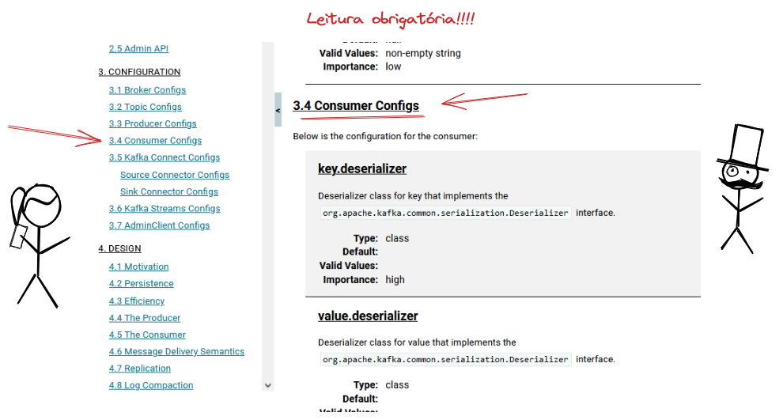
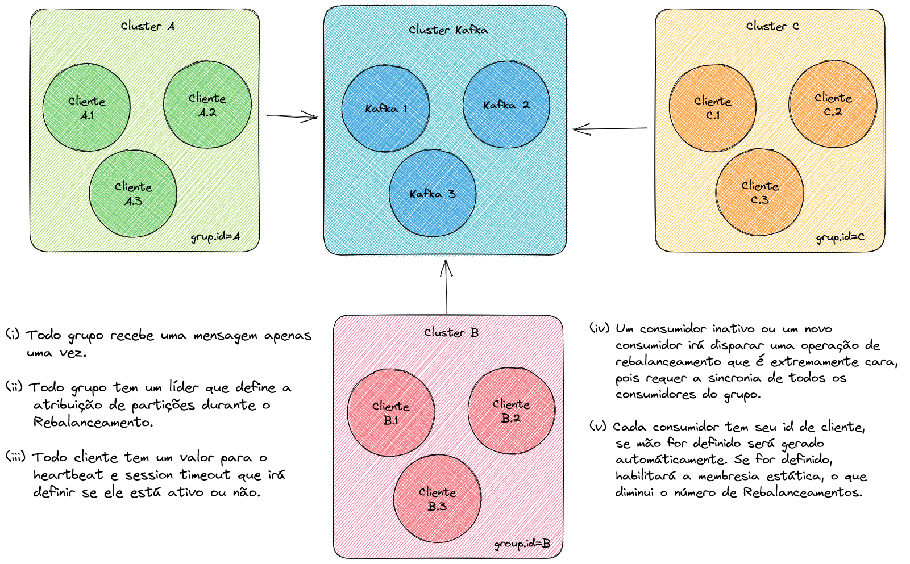
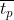
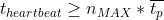
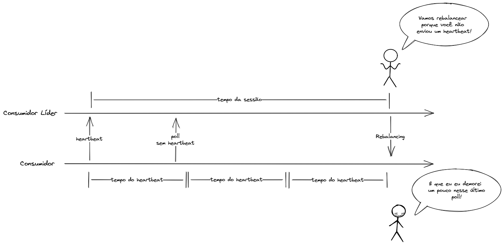
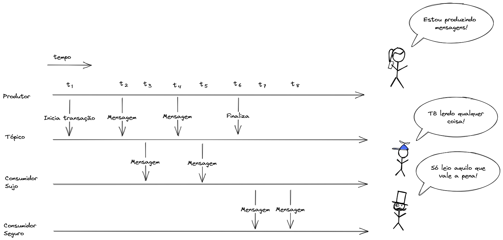

# 3. Como criar um Consumidor de Mensagens

[Voltar](./02-criando-um-produtor.md) [Próximo](./04-criando-um-topico.md)

## 3.1. Criando um projeto Java e configurando as bibliotecas necessárias

De forma semelhante ao que foi feito no produtor, crie um projeto e adicione a biblioteca `kafka-clients`.

```bash
mvn archetype:generate -DgroupId=io.vepo.kafka.imersao -DartifactId=meu-primeiro-consumidor -DarchetypeArtifactId=maven-archetype-quickstart -DarchetypeVersion=1.4 -DinteractiveMode=false
```

```xml
<dependency>
    <groupId>org.apache.kafka</groupId>
    <artifactId>kafka-clients</artifactId>
    <version>3.4.0</version>
</dependency>
```

## 3.2. Criando a classe consumidora e informando o Maven que ela deve ser executada

Nosso exemplo será um Produtor de informações climáticas, por isso vou criar a classe `WeatherSensorCollector`, ela vai pertencer ao pacote `io.vepo.sensor.weather`, logo deve ser colocada na estrutura abaixo:

```
.
├── src                      ## Todo o código deve ser armazenado nessa pasta
│   ├── main                 ## Código de produção
|   |   ├── java             ## Código Java de produção
|   |   |   └── io
|   |   |       └── vepo
|   |   |           └── sensor
|   |   |               └── weather
|   |   |                   └── WeatherSensorConsumer.java
|   |   └── resources        ## Arquivos que não serão compilados, mas estarão disponíveis em tempo de execução
│   └── test                 ## Código usado para testes unitários
|       ├── java             ## Código Java para testes unitários
|       └── resources        ## Arquivos que não serão compilados, mas estarão disponíveis em tempo de execução
└── pom.xml                  ## Arquivo que define como será feita a build
```

Criada a classe, podemos verificar se está tudo certo executando ela usando o Maven:

```bash
mvn clean compile exec:java -Dexec.mainClass=io.vepo.sensor.weather.WeatherSensorConsumer
```

Para facilitar nossa vida, vamos adicionar definir a classe principal direto no jar e como configuração padrão para execução.

Adicione o seguinte plugin (procure por `build` → `plugins` ou `build` → `pluginManagement` → `plugins`) para configurar a build:

```xml
<plugin>
    <groupId>org.codehaus.mojo</groupId>
    <artifactId>exec-maven-plugin</artifactId>
    <version>3.1.0</version>
    <configuration>
        <mainClass>io.vepo.sensor.weather.WeatherSensorCollector</mainClass>
    </configuration>
</plugin>
```

Agora para executar, basta usar:

```bash
mvn clean compile exec:java
```

Para definir que essa classe de execução do jar, altere a configuração do plugin `maven-jar-plugin`:

```xml
<plugin>
    <artifactId>maven-jar-plugin</artifactId>
    <version>3.0.2</version>
    <configuration>
        <archive>
            <manifest>
                <addClasspath>true</addClasspath>
                <mainClass>io.vepo.sensor.weather.WeatherSensorConsumer </mainClass>
            </manifest>
        </archive>
    </configuration>
</plugin>
```

Para executar é preciso primeiro criar o jar:

```bash
mvn clean package
java -jar target/meu-primeiro-consumidor-1.0-SNAPSHOT.jar
```

## 3.3. Implementando o Consumidor

Antes de implementar essa classe, vamos criar alguns pressupostos sobre como ela vai ser utilizada.

1. Todo consumidor Kafka implementa um Loop de poll-process-commit
2. Nossa classe irá consumir dados automaticamente, devemos apenas iniciar uma thread
3. O consumidor irá fazer uma agregação em memória dos dados de temperatura calculando temperatura máxima e mínima e vento máximo e mínimo por dia.
4. A classe já receberá o consumidor inicializado.

```java
WeatherSensorConsumer consumer = new WeatherSensorConsumer(new KafkaConsumer<>(/* inicialização */));
consumer.start();
```

### 3.3.1. Implementando os Deserializers

O primeiro passo quando vamos pensa em um consumidor é escolher nossos Deserializador. Devemos escolher o deserializador dos valores e das chaves. A biblioteca padrão do Kafka já vem com alguns deserializadores, mas eles se resumem a tipos primitivos e objetos simples. O recomendado é que usemos um deserializador open source, como o da Confluent ou da Red Hat, mas para estudo vamos implementar nosso próprio.

Todo deserializador deve implementar a interface [Deserializer](https://kafka.apache.org/34/javadoc/org/apache/kafka/common/serialization/Deserializer.html), [código da biblioteca padrão é aberto](https://github.com/apache/kafka/blob/trunk/clients/src/main/java/org/apache/kafka/common/serialization/Deserializer.java) e podemos ver que são disponibilizado deserializadores para `boolean` ([**BooleanDeserializer**](https://github.com/apache/kafka/blob/trunk/clients/src/main/java/org/apache/kafka/common/serialization/BooleanDeserializer.java)), `byte[]` ([**ByteArrayDeserializer**](https://github.com/apache/kafka/blob/trunk/clients/src/main/java/org/apache/kafka/common/serialization/ByteArrayDeserializer.java)), `ByteBuffer` ([**ByteBufferDeserializer**](https://github.com/apache/kafka/blob/trunk/clients/src/main/java/org/apache/kafka/common/serialization/ByteBufferDeserializer.java)), `Bytes` (um tipo de byte[] imutável do Kafka, [**BytesDeserializer**](https://github.com/apache/kafka/blob/trunk/clients/src/main/java/org/apache/kafka/common/serialization/BytesDeserializer.java)), `double` ([**DoubleDeserializer**](https://github.com/apache/kafka/blob/trunk/clients/src/main/java/org/apache/kafka/common/serialization/DoubleDeserializer.java)), `float` ([**FloatDeserializer**](https://github.com/apache/kafka/blob/trunk/clients/src/main/java/org/apache/kafka/common/serialization/FloatDeserializer.java)), `int` ([**IntegerDeserializer**](https://github.com/apache/kafka/blob/trunk/clients/src/main/java/org/apache/kafka/common/serialization/IntegerDeserializer.java)), `long` ([**LongDeserializer**](https://github.com/apache/kafka/blob/trunk/clients/src/main/java/org/apache/kafka/common/serialization/LongDeserializer.java)), `short` ([**ShortDeserializer**](https://github.com/apache/kafka/blob/trunk/clients/src/main/java/org/apache/kafka/common/serialization/ShortDeserializer.java)), `String` ([**StringDeserializer**](https://github.com/apache/kafka/blob/trunk/clients/src/main/java/org/apache/kafka/common/serialization/StringDeserializer.java)), `UUID` ([**UUIDDeserializer**](https://github.com/apache/kafka/blob/trunk/clients/src/main/java/org/apache/kafka/common/serialization/UUIDDeserializer.java)) e `null` ([**VoidDeserializer**](https://github.com/apache/kafka/blob/trunk/clients/src/main/java/org/apache/kafka/common/serialization/VoidDeserializer.java)).

As bibliotecas de deserialização vão depender de Schema, que falaremos depois. Pela [Confluent](https://docs.confluent.io/platform/current/schema-registry/fundamentals/serdes-develop/index.html#supported-formats) temos o [**KafkaAvroDeserializer**](https://github.com/confluentinc/schema-registry/blob/master/avro-serializer/src/main/java/io/confluent/kafka/serializers/KafkaAvroDeserializer.java) para [AVRO](https://avro.apache.org/docs/1.11.1/specification/), [**KafkaProtobufDeserializer**](https://github.com/confluentinc/schema-registry/blob/master/protobuf-serializer/src/main/java/io/confluent/kafka/serializers/protobuf/KafkaProtobufDeserializer.java) para [ProtoBuf](https://protobuf.dev/programming-guides/proto3/) e [**KafkaJsonSchemaDeserializer**](https://github.com/confluentinc/schema-registry/blob/master/json-schema-serializer/src/main/java/io/confluent/kafka/serializers/json/KafkaJsonSchemaDeserializer.java) para [JSON](https://www.json.org/json-en.html). Pela [Red Hat](https://www.apicur.io/registry/docs/apicurio-registry/2.4.x/getting-started/assembly-configuring-kafka-client-serdes.html), temos o [**AvroKafkaDeserializer**](https://github.com/Apicurio/apicurio-registry/blob/main/serdes/avro-serde/src/main/java/io/apicurio/registry/serde/avro/AvroKafkaDeserializer.java) para [AVRO](https://avro.apache.org/docs/1.11.1/specification/) e [**ProtobufKafkaDeserializer**](https://github.com/Apicurio/apicurio-registry/blob/main/serdes/protobuf-serde/src/main/java/io/apicurio/registry/serde/protobuf/ProtobufKafkaDeserializer.java) para [ProtoBuf](https://protobuf.dev/programming-guides/proto3/). Esses formatos dependem da troca de Schema entre o produtor e o consumidor, o que implica no uso de um servidor de registro de schemas, que são o [Schema Registry](https://docs.confluent.io/platform/current/schema-registry/index.html#about-sr) da Confluent e o [Apicurio Registry](https://www.apicur.io/registry/docs/apicurio-registry/2.4.x/index.html) da Red Hat.


Podemos ver abaixo o código da interface Deserializer. Devemos implementar o método `T deserialize(String topic, byte[] data);` e apesar de existir o um método com o argumento `Headers` ele não faz parte do corpo da mensagem e falaremos mais a frente.

```java
/**
 * An interface for converting bytes to objects.
 *
 * A class that implements this interface is expected to have a constructor with no parameters.
 * <p>
 * Implement {@link org.apache.kafka.common.ClusterResourceListener} to receive cluster metadata once it's available. Please see the class documentation for ClusterResourceListener for more information.
 *
 * @param <T> Type to be deserialized into.
 */
public interface Deserializer<T> extends Closeable {

    /**
     * Configure this class.
     * @param configs configs in key/value pairs
     * @param isKey whether is for key or value
     */
    default void configure(Map<String, ?> configs, boolean isKey) {
        // intentionally left blank
    }

    /**
     * Deserialize a record value from a byte array into a value or object.
     * @param topic topic associated with the data
     * @param data serialized bytes; may be null; implementations are recommended to handle null by returning a value or null rather than throwing an exception.
     * @return deserialized typed data; may be null
     */
    T deserialize(String topic, byte[] data);

    /**
     * Deserialize a record value from a byte array into a value or object.
     * @param topic topic associated with the data
     * @param headers headers associated with the record; may be empty.
     * @param data serialized bytes; may be null; implementations are recommended to handle null by returning a value or null rather than throwing an exception.
     * @return deserialized typed data; may be null
     */
    default T deserialize(String topic, Headers headers, byte[] data) {
        return deserialize(topic, data);
    }

    /**
     * Close this deserializer.
     * <p>
     * This method must be idempotent as it may be called multiple times.
     */
    @Override
    default void close() {
        // intentionally left blank
    }
}
```

Como todo deserializer deve seguir o mesmo padrão do Serializer, senão serão inconsistentes, vamos optar por uma solução simples usando [`ByteBuffer`](https://docs.oracle.com/javase/8/docs/api/java/nio/ByteBuffer.html) para deserializar nossos objetos de domínio. Segue abaixo como ficaria a implementação.

```java
public class WeatherInfoDeserializer implements Deserializer<WeatherInfo> {

    @Override
    public WeatherInfo deserialize(String topic, byte[] data) {
        ByteBuffer buffer = ByteBuffer.wrap(data);
        double lat = buffer.getDouble();
        double lon = buffer.getDouble();
        double temperature = buffer.getDouble();
        double wind = buffer.getDouble();
        long timestamp = buffer.getLong();
        return new WeatherInfo(new Geolocation(lat, lon), temperature, wind, timestamp);
    }
}
```

```java
public class GeolocationDeserializer implements Deserializer<Geolocation> {

    @Override
    public Geolocation deserialize(String topic, byte[] data) {
        ByteBuffer buffer = ByteBuffer.wrap(data);
        double lat = buffer.getDouble();
        double lon = buffer.getDouble();
        return new Geolocation(lat, lon);
    }
}
```

### 3.3.2. Definindo as configurações

O próximo passo é definir as configurações do Consumidor. Quando vamos inicializar qualquer cliente Kafka, ele pode receber como parâmetro um [**Properties**](https://docs.oracle.com/javase/8/docs/api/java/util/Properties.html) ou um **Map<String, Object>** com os valores que serão usados para configurar o consumidor e tudo relacionado a ele (deserializers, interceptors, etc...). Os valores aceitos como padrão estão na [documentação do site do Kafka](https://kafka.apache.org/documentation/#consumerconfigs), é uma leitura obrigatória. 



Fonte: https://excalidraw.com/#json=P4ZmiPhqVFdCSC2Vo27XV,kdl5j-Z1aBDH_u1L9H7jOg

Abaixo eu listo as configurações mais importantes, mas você não precisa decorar essas chaves, pode usar a classe [**ConsumerConfig**](https://kafka.apache.org/34/javadoc/org/apache/kafka/clients/consumer/ConsumerConfig.html) que além de ter toda as chaves, tem toda a documentação associada a ela.

* `key.deserializer`
* `value.deserializer`
* `bootstrap.servers`
* `group.id`
* `group.instance.id`
* `partition.assignment.strategy`
* `isolation.level`
* `interceptor.classes`
* `heartbeat.interval.ms`
* `session.timeout.ms`
* `max.poll.records`
* `max.poll.interval.ms`
* `enable.auto.commit`
* `auto.commit.interval.ms`

Assim para definir as propriedades que vamos usar basta:

```java
Properties properties = new Properties();
properties.put(ConsumerConfig.BOOTSTRAP_SERVERS_CONFIG, "localhost:9092");
properties.put(ConsumerConfig.GROUP_ID_CONFIG, "meu-primeiro-consumidor");
properties.put(ConsumerConfig.KEY_DESERIALIZER_CLASS_CONFIG, GeolocationDeserializer.class);
properties.put(ConsumerConfig.VALUE_DESERIALIZER_CLASS_CONFIG, WeatherInfoDeserializer.class);
```

Diferentemente do Produtor, o consumidor exige que seja definido um ID do Grupo. Esse ID será usado para garantir que uma mensagem seja enviada apenas uma vez para um grupo. Consumidores com mesmo ID criam um cluster.



### 3.3.3. Instanciando e usando o Consumidor

Agora precisamos definir a classe que vai encapsular o consumidor. As responsabilidades dela serão:

* Escutar o Tópico
* Consumir automaticamente as informações 
* Agregar todas as informações pela chave fornecida

```java
public class WeatherSensorConsumer implements AutoCloseable {

    private static final Logger logger = LoggerFactory.getLogger(WeatherSensorConsumer.class);
    private Consumer<Geolocation, WeatherInfo> consumer;
    private CountDownLatch latch;
    private AtomicBoolean running;

    private Map<Geolocation, WeatherAggregate> cache;

    public WeatherSensorConsumer(Consumer<Geolocation, WeatherInfo> consumer) {
        this.consumer = consumer;
        this.latch = new CountDownLatch(1);
        this.running = new AtomicBoolean(true);
        this.cache = new HashMap<>();
    }

    @Override
    public void close() {
        consumer.close();
    }

    public void join() {
        try {
            latch.await();
        } catch (InterruptedException e) {
            Thread.currentThread().interrupt();
        }
    }

    public void consume() {
        consumer.subscribe(Arrays.asList("weather"));
        while (running.get()) {
            consumer.poll(Duration.ofSeconds(1))
                    .forEach(this::consumeWeatherInfo);
        }
        latch.countDown();
    }

    public void start() {
        Runtime.getRuntime()
               .addShutdownHook(new Thread() {
                   @Override
                   public void run() {
                       running.set(false);
                       try {
                           latch.await();
                       } catch (InterruptedException e) {
                           Thread.currentThread().interrupt();
                       }
                   }
               });

        Executors.newSingleThreadExecutor()
                 .submit(this::consume);
    }

    private void consumeWeatherInfo(ConsumerRecord<Geolocation, WeatherInfo> weatherInfo) {
        logger.info("Processando valor! mensagem={}", weatherInfo);
        if (Objects.isNull(weatherInfo.key())) {
            logger.warn("Chave nula! Ignorando registro! {}", weatherInfo);
        } else {
            WeatherAggregate aggre = cache.compute(weatherInfo.key(), 
                                                   (key, value) -> {
                                                       if (Objects.isNull(value)) {
                                                           return new WeatherAggregate(weatherInfo.value().getTemperature(),
                                                                                       weatherInfo.value().getTemperature(),
                                                                                       weatherInfo.value().getWind(),
                                                                                       weatherInfo.value().getWind());
                                                       } else {
                                                           return new WeatherAggregate(Math.max(value.getMaxTemperature(), weatherInfo.value().getTemperature()),
                                                                                       Math.min(value.getMinTemperature(), weatherInfo.value().getTemperature()),
                                                                                       Math.max(value.getMaxWind(), weatherInfo.value().getWind()),
                                                                                       Math.min(value.getMinWind(), weatherInfo.value().getWind()));
                                                       }
                                                   });
            logger.info("Valor: {}", aggre);
        }
    }
}
```

De forma semelhante ao produtor, estamos recebendo [**Consumer**](https://kafka.apache.org/34/javadoc/org/apache/kafka/clients/consumer/Consumer.html) para que possamos depois testar usando [**MockConsumer**](https://kafka.apache.org/34/javadoc/org/apache/kafka/clients/consumer/MockConsumer.html)!

Quando implementamos o caso mais simples, precisamos apenas conhecer os métodos [**subscribe**](https://kafka.apache.org/34/javadoc/org/apache/kafka/clients/consumer/MockConsumer.html#subscribe(java.util.Collection)) e [**poll**](https://kafka.apache.org/34/javadoc/org/apache/kafka/clients/consumer/MockConsumer.html#poll(java.time.Duration)) e as classes [**ConsumerRecords**](https://kafka.apache.org/34/javadoc/org/apache/kafka/clients/consumer/ConsumerRecords.html) e [**ConsumerRecord**](https://kafka.apache.org/34/javadoc/org/apache/kafka/clients/consumer/ConsumerRecord.html). Mas o consumidor é muito mais complexo do que o produtor, existem algumas definições importantes que precisamos conhecer:
* Heartbeat/Session
* Operação de Rebalanceamento
* Commit/Offset/Assignment

Por isso vamos falar agora da dinâmica do cluster de consumidores.

### 3.3.4 Dinâmica do Cluster de Consumidor

Vamos falar de como o cluster de consumidores se comporta, para isso defini 3 operações básicas:

1. Informando o estado do Cluster (_Heartbeat_/_Session_)
2. Redistribuindo Carga (Operação de Rebalanceamento)
3. Controlando posição de leitura (_Commit_/_Offset_/_Assignment_)
4. Definindo o nível de isolamento

Cada cluster de consumidores tem um líder que coordenará essas operações, elas não são responsabilidade do Broker.

#### 3.3.4.1 Informando o estado do Cluster (_Heartbeat_/_Session_)

O líder do cluster tem que saber se um um consumidor ainda está ativo ou não. Essa operação é feita através do envio de uma mensagem chamada Heartbeat pelo consumidor. Essa mensagem é enviada quando o método [**poll**](https://kafka.apache.org/34/javadoc/org/apache/kafka/clients/consumer/MockConsumer.html#poll(java.time.Duration)) é executado baseado no valor da configuração `heartbeat.interval.ms`. Se o consumidor não enviar essa mensagem, o líder irá assumir que ele está inativo através do valor de `session.timeout.ms`.

Essa configuração é muito importante para o caso em que o processamento da mensagem é demorado. Se o processamento for lento, esses valores devem ser reajustados para que o tempo de processamento nunca seja maior que o _heartbeat_, mas esteja atento que não estamos falando do processamento de apenas uma mensagem, mas de um conjunto de mensagens. O número de mensagens retornado pode ser limitado usando a configuração `max.poll.records`. Logo se considerarmos o tempo médio de processamento de uma mensagem  e o número máximo de mensagens retornadas durante o _poll_ , o valor do `heartbeat` deve ser:




Fonte: https://excalidraw.com/#json=oZE7NFRkeGa1052_CJ0-J,LHT49KVB22b9z3lB1GTQWA


Para o tempo da sessão é recomendado que ele seja ao menos 3x o valor do _heartbeat_, essa indicação é para se evitar que o _heartbeat_ esteja desincronizado com o intervalo da sessão. Se o **_poll_** for feito antes do tempo do heartbeat expirar, a mensagem pode não ser enviada e por isso o tempo da sessão tem que ser ao menos 3x o tempo do _heartbeat_.



#### 3.3.4.2 Redistribuindo Carga (Operação de Rebalanceamento)

Um Rebalanceamento é disparado quando o consumidor líder identifica um novo consumidor ou um consumidor inativo. Para que ela seja possível ele irá bloquear todos os consumidores na operação de **_poll_** enquanto a operação não for terminada. Quando todos estão alinhados (ou o valor de `rebalance.timeout.ms` expirar) o líder irá redistribuir as partições entre todos os consumidores ativos.

O Rebalanceamento é uma operação extremamente cara e deve ser evitada a qualquer custo. Usando uma linguagem do mundo **Java**, é um evento **Stop the world**. Por isso é importante um ajuste dos parametros citados.

Caso seja necessário escutar quando essas operações estão ocorrendo, é possivel cadastrar um _listener_ [**ConsumerRebalanceListener**](https://kafka.apache.org/34/javadoc/org/apache/kafka/clients/consumer/ConsumerRebalanceListener.html) durante o [**subscribe**](https://kafka.apache.org/34/javadoc/org/apache/kafka/clients/consumer/KafkaConsumer.html#subscribe(java.util.Collection,org.apache.kafka.clients.consumer.ConsumerRebalanceListener)).

#### 3.3.4.3 Controlando posição de leitura (_Commit_/_Offset_/_Assignment_)

O controle da posição de leitura é feito através do offset da partição. Cada mensagem pode ser descrita através das coordenadas tópico, partição e offset. 

No nosso exemplo não definimos nenhum mecanismo de controle da posição de leitura, com isso estamos confiando no mecanismo de auto **_commit_** to consumidor que a cada 5s efetua o **_commit_** para todas as mensagens retornadas durante o **_poll_**. Para se alterar esse valor é preciso definir usando a configuração `auto.commit.interval.ms`.

Caso se deseje fazer um controle fino das mensagens consumidas, deve-se usar os métodos [**commitAsync**](https://kafka.apache.org/34/javadoc/org/apache/kafka/clients/consumer/KafkaConsumer.html#commitAsync()) e [**commitSync**](https://kafka.apache.org/34/javadoc/org/apache/kafka/clients/consumer/KafkaConsumer.html#commitSync()) para se efetuar o **_commit_**. É possível também mudar a posição de leitura através dos métodos [**seek**](https://kafka.apache.org/34/javadoc/org/apache/kafka/clients/consumer/KafkaConsumer.html#seek(org.apache.kafka.common.TopicPartition,long)), [**seekToBeginning**](https://kafka.apache.org/34/javadoc/org/apache/kafka/clients/consumer/KafkaConsumer.html#seekToBeginning(java.util.Collection)) e [**seekToEnd**](https://kafka.apache.org/34/javadoc/org/apache/kafka/clients/consumer/KafkaConsumer.html#seekToEnd(java.util.Collection)).

**ATENÇÃO**

A operação de _commit_ deve ser feita se baseando no offset da próxima mensagem a ser lida e não no offset da última mensagem processada. Veja o exemplo abaixo contido na documentação da classe [**KafkaConsumer**](https://kafka.apache.org/34/javadoc/org/apache/kafka/clients/consumer/KafkaConsumer.html). Observe que o processamento é feito por partição, que é o que veremos no próximo tópico.

```java
try {
    while(running) {
        ConsumerRecords<String, String> records = consumer.poll(Duration.ofMillis(Long.MAX_VALUE));
        for (TopicPartition partition : records.partitions()) {
            List<ConsumerRecord<String, String>> partitionRecords = records.records(partition);
            for (ConsumerRecord<String, String> record : partitionRecords) {
                System.out.println(record.offset() + ": " + record.value());
            }
            long lastOffset = partitionRecords.get(partitionRecords.size() - 1).offset();
            consumer.commitSync(Collections.singletonMap(partition, new OffsetAndMetadata(lastOffset + 1))); // sempre adicione +1
        }
    }
} finally {
    consumer.close();
}
```

Por fim fica uma última pergunta: _para agilizar, posso processar usando várias threads?_

A resposta é SIM e NÃO! Nunca use um mesmo **KafkaConsumer** em multiplas _threads_, caso seja necessário crie um **KafkaConsumer** por _thread_. A explicação é porque o consumo é feito por partição e é sequencial. Se houver o compartilhamento de um mesmo **KafkaConsumer** por várias _threads_ registros de uma mesma partição vão ser processados asincronamente, o que pode acarretar em perda de dados ou reprocessamento. Se for criado mais de um **KafkaConsumer** cada um estará escutando uma partição especifica, o que resultará no processamento sequencial da partição sincronamente.

#### 3.3.4.4 Definindo o nível de isolamento

Lembra que falamos que é possível implementar transações usando o [**KafkaProducer**](https://kafka.apache.org/34/javadoc/org/apache/kafka/clients/producer/KafkaProducer.html)? 

Quando fazemos isso precisamos também definir o tipo de isolamento que nosso consumer terá e isso é feito através da configuração `isolation.level`.

O valor padrão de `isolation.level` é `read_uncommitted` o que implica que assim que uma mensagem é publica pelo produtor ela será lida pelo consumidor, inclusive mensagens de transações abortadas. Se desejamos ler apenas mensagens em que estão em transações finalizadas com sucesso precisamos mudar esse valor para `read_committed`.



Fonte: https://excalidraw.com/#json=HvHzhacD2wGzeHGlztO6R,0PUFq21veX_GNr5nhLxd3A

[Voltar](./02-criando-um-produtor.md) [Próximo](./04-criando-um-topico.md)