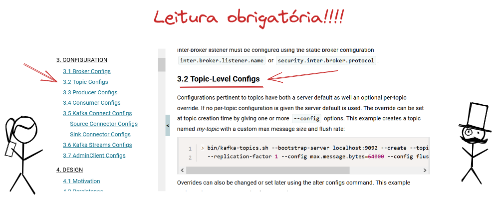
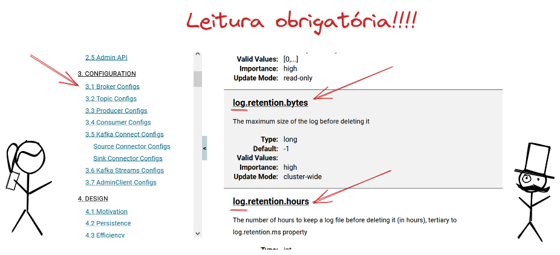

# 4. Como criar um tópicos

[Voltar](./03-criando-um-consumidor.md) [Próximo](./05-criando-um-stream.md)

Já estamos usando o nosso Broker Kafka mas não criamos nenhum tópico. Isso só é possível porque na configuração do broker o valor de `auto.create.topics.enable` é `true`, caso fosse `false` não teria sido possível publica e consumir mensagens.

É importante sempre criar o tópico antes de o usar por dois motivos:
* Garantir as configurações do tópici
* Em alguns casos (principalmente em Streams) ele não é criado automaticamente

Nessa sessão vamos passar por alguns comando que vão nos auxiliar a gerenciar tópicos em um cluster Kafka.

# 4.1. Conhecendo a ferramenta

A ferramenta que vamos usar para gerenciar os tópicos é o script `./bin/kafka-topics.sh` já disponível em qualquer instalação Kafka. Para se utilizar esse script é preciso so definir o parâmetro `--bootstrap-server` se não houver nenhuma configuração de segurança, caso contrário deverá ser usado também o parâmetro `--command-config`.

```bash
$ ./bin/kafka-topics.sh --help
This tool helps to create, delete, describe, or change a topic.
Option                                   Description
------                                   -----------
--alter                                  Alter the number of partitions,
                                           replica assignment, and/or
                                           configuration for the topic.
--at-min-isr-partitions                  if set when describing topics, only
                                           show partitions whose isr count is
                                           equal to the configured minimum.
--bootstrap-server <String: server to    REQUIRED: The Kafka server to connect
  connect to>                              to.
--command-config <String: command        Property file containing configs to be
  config property file>                    passed to Admin Client. This is used
                                           only with --bootstrap-server option
                                           for describing and altering broker
                                           configs.
--config <String: name=value>            A topic configuration override for the
                                           topic being created or altered. The
                                           following is a list of valid
                                           configurations:
                                                cleanup.policy
                                                compression.type
                                                delete.retention.ms
                                                file.delete.delay.ms
                                                flush.messages
                                                flush.ms
                                                follower.replication.throttled.replicas
                                                index.interval.bytes
                                                leader.replication.throttled.replicas
                                                local.retention.bytes
                                                local.retention.ms
                                                max.compaction.lag.ms
                                                max.message.bytes
                                                message.downconversion.enable
                                                message.format.version
                                                message.timestamp.difference.max.ms
                                                message.timestamp.type
                                                min.cleanable.dirty.ratio
                                                min.compaction.lag.ms
                                                min.insync.replicas
                                                preallocate
                                                remote.storage.enable
                                                retention.bytes
                                                retention.ms
                                                segment.bytes
                                                segment.index.bytes
                                                segment.jitter.ms
                                                segment.ms
                                                unclean.leader.election.enable
                                         See the Kafka documentation for full
                                           details on the topic configs. It is
                                           supported only in combination with --
                                           create if --bootstrap-server option
                                           is used (the kafka-configs CLI
                                           supports altering topic configs with
                                           a --bootstrap-server option).
--create                                 Create a new topic.
--delete                                 Delete a topic
--delete-config <String: name>           A topic configuration override to be
                                           removed for an existing topic (see
                                           the list of configurations under the
                                           --config option). Not supported with
                                           the --bootstrap-server option.
--describe                               List details for the given topics.
--disable-rack-aware                     Disable rack aware replica assignment
--exclude-internal                       exclude internal topics when running
                                           list or describe command. The
                                           internal topics will be listed by
                                           default
--help                                   Print usage information.
--if-exists                              if set when altering or deleting or
                                           describing topics, the action will
                                           only execute if the topic exists.
--if-not-exists                          if set when creating topics, the
                                           action will only execute if the
                                           topic does not already exist.
--list                                   List all available topics.
--partitions <Integer: # of partitions>  The number of partitions for the topic
                                           being created or altered (WARNING:
                                           If partitions are increased for a
                                           topic that has a key, the partition
                                           logic or ordering of the messages
                                           will be affected). If not supplied
                                           for create, defaults to the cluster
                                           default.
--replica-assignment <String:            A list of manual partition-to-broker
  broker_id_for_part1_replica1 :           assignments for the topic being
  broker_id_for_part1_replica2 ,           created or altered.
  broker_id_for_part2_replica1 :
  broker_id_for_part2_replica2 , ...>
--replication-factor <Integer:           The replication factor for each
  replication factor>                      partition in the topic being
                                           created. If not supplied, defaults
                                           to the cluster default.
--topic <String: topic>                  The topic to create, alter, describe
                                           or delete. It also accepts a regular
                                           expression, except for --create
                                           option. Put topic name in double
                                           quotes and use the '\' prefix to
                                           escape regular expression symbols; e.
                                           g. "test\.topic".
--topic-id <String: topic-id>            The topic-id to describe.This is used
                                           only with --bootstrap-server option
                                           for describing topics.
--topics-with-overrides                  if set when describing topics, only
                                           show topics that have overridden
                                           configs
--unavailable-partitions                 if set when describing topics, only
                                           show partitions whose leader is not
                                           available
--under-min-isr-partitions               if set when describing topics, only
                                           show partitions whose isr count is
                                           less than the configured minimum.
--under-replicated-partitions            if set when describing topics, only
                                           show under replicated partitions
--version                                Display Kafka version.
```

# 4.2. Listando os tópicos existentes

Nossa primeira operação será exploratória e vamos listar todos os tópicos existentes no cluster Kafka. Para isso vamos usar o parâmetro `--list`.

```
$ ./bin/kafka-topics.sh --bootstrap-server localhost:9092 --list
__consumer_offsets
weather
```

Vemos que existem só 2 tópicos criados, o `weather` que é o tópico que publicamos mensagens e o `__consumer_offsets` que é o tópico usado pelo Kafka para controlar a posição de leitura dos consumidores. Todo tópico iniciado por `__` é um tópico interno do Kafka.

# 4.3. Descrevendo um tópico

Para descrever um tópico podemos usar o parâmetro `--describe`. Com ele é possível descrever um ou todos os tópicos. Se usarmos o parâmetro `--topic` vamos descrever somente um tópico, mas se ele for omitido todos os tópicos do cluster serão descritos.

```bash
$ ./bin/kafka-topics.sh --bootstrap-server localhost:9092 --describe --topic weather
Topic: weather  TopicId: QeT5dwWnSVy9JEpsvPW0xg PartitionCount: 1       ReplicationFactor: 1    Configs: segment.bytes=1073741824
        Topic: weather  Partition: 0    Leader: 1       Replicas: 1     Isr: 1
```

Com as informações acima podemos descobrir que o tópico tem somente 1 partição que está alocada no broker 1 que é o líder e está como ISR (In Sync Replica). Esse tópico só tem uma configuração que é o tamanho máximo do segmento definido como 1GiB.

Podemos também perdir para se descrever todos os tópicos.

```bash
$ ./bin/kafka-topics.sh --bootstrap-server localhost:9092 --describe
Topic: weather  TopicId: QeT5dwWnSVy9JEpsvPW0xg PartitionCount: 1       ReplicationFactor: 1    Configs: segment.bytes=1073741824
        Topic: weather  Partition: 0    Leader: 1       Replicas: 1     Isr: 1
Topic: __consumer_offsets       TopicId: H9HQ6o54Slyzcw5B1F9IuA PartitionCount: 50      ReplicationFactor: 1    Configs: compression.type=producer,cleanup.policy=compact,segment.bytes=104857600
        Topic: __consumer_offsets       Partition: 0    Leader: 1       Replicas: 1     Isr: 1
        Topic: __consumer_offsets       Partition: 1    Leader: 1       Replicas: 1     Isr: 1
        Topic: __consumer_offsets       Partition: 2    Leader: 1       Replicas: 1     Isr: 1
        Topic: __consumer_offsets       Partition: 3    Leader: 1       Replicas: 1     Isr: 1
        Topic: __consumer_offsets       Partition: 4    Leader: 1       Replicas: 1     Isr: 1
        Topic: __consumer_offsets       Partition: 5    Leader: 1       Replicas: 1     Isr: 1
        Topic: __consumer_offsets       Partition: 6    Leader: 1       Replicas: 1     Isr: 1
        Topic: __consumer_offsets       Partition: 7    Leader: 1       Replicas: 1     Isr: 1
        Topic: __consumer_offsets       Partition: 8    Leader: 1       Replicas: 1     Isr: 1
        Topic: __consumer_offsets       Partition: 9    Leader: 1       Replicas: 1     Isr: 1
        Topic: __consumer_offsets       Partition: 10   Leader: 1       Replicas: 1     Isr: 1
        Topic: __consumer_offsets       Partition: 11   Leader: 1       Replicas: 1     Isr: 1
        Topic: __consumer_offsets       Partition: 12   Leader: 1       Replicas: 1     Isr: 1
        Topic: __consumer_offsets       Partition: 13   Leader: 1       Replicas: 1     Isr: 1
        Topic: __consumer_offsets       Partition: 14   Leader: 1       Replicas: 1     Isr: 1
        Topic: __consumer_offsets       Partition: 15   Leader: 1       Replicas: 1     Isr: 1
        Topic: __consumer_offsets       Partition: 16   Leader: 1       Replicas: 1     Isr: 1
        Topic: __consumer_offsets       Partition: 17   Leader: 1       Replicas: 1     Isr: 1
        Topic: __consumer_offsets       Partition: 18   Leader: 1       Replicas: 1     Isr: 1
        Topic: __consumer_offsets       Partition: 19   Leader: 1       Replicas: 1     Isr: 1
        Topic: __consumer_offsets       Partition: 20   Leader: 1       Replicas: 1     Isr: 1
        Topic: __consumer_offsets       Partition: 21   Leader: 1       Replicas: 1     Isr: 1
        Topic: __consumer_offsets       Partition: 22   Leader: 1       Replicas: 1     Isr: 1
        Topic: __consumer_offsets       Partition: 23   Leader: 1       Replicas: 1     Isr: 1
        Topic: __consumer_offsets       Partition: 24   Leader: 1       Replicas: 1     Isr: 1
        Topic: __consumer_offsets       Partition: 25   Leader: 1       Replicas: 1     Isr: 1
        Topic: __consumer_offsets       Partition: 26   Leader: 1       Replicas: 1     Isr: 1
        Topic: __consumer_offsets       Partition: 27   Leader: 1       Replicas: 1     Isr: 1
        Topic: __consumer_offsets       Partition: 28   Leader: 1       Replicas: 1     Isr: 1
        Topic: __consumer_offsets       Partition: 29   Leader: 1       Replicas: 1     Isr: 1
        Topic: __consumer_offsets       Partition: 30   Leader: 1       Replicas: 1     Isr: 1
        Topic: __consumer_offsets       Partition: 31   Leader: 1       Replicas: 1     Isr: 1
        Topic: __consumer_offsets       Partition: 32   Leader: 1       Replicas: 1     Isr: 1
        Topic: __consumer_offsets       Partition: 33   Leader: 1       Replicas: 1     Isr: 1
        Topic: __consumer_offsets       Partition: 34   Leader: 1       Replicas: 1     Isr: 1
        Topic: __consumer_offsets       Partition: 35   Leader: 1       Replicas: 1     Isr: 1
        Topic: __consumer_offsets       Partition: 36   Leader: 1       Replicas: 1     Isr: 1
        Topic: __consumer_offsets       Partition: 37   Leader: 1       Replicas: 1     Isr: 1
        Topic: __consumer_offsets       Partition: 38   Leader: 1       Replicas: 1     Isr: 1
        Topic: __consumer_offsets       Partition: 39   Leader: 1       Replicas: 1     Isr: 1
        Topic: __consumer_offsets       Partition: 40   Leader: 1       Replicas: 1     Isr: 1
        Topic: __consumer_offsets       Partition: 41   Leader: 1       Replicas: 1     Isr: 1
        Topic: __consumer_offsets       Partition: 42   Leader: 1       Replicas: 1     Isr: 1
        Topic: __consumer_offsets       Partition: 43   Leader: 1       Replicas: 1     Isr: 1
        Topic: __consumer_offsets       Partition: 44   Leader: 1       Replicas: 1     Isr: 1
        Topic: __consumer_offsets       Partition: 45   Leader: 1       Replicas: 1     Isr: 1
        Topic: __consumer_offsets       Partition: 46   Leader: 1       Replicas: 1     Isr: 1
        Topic: __consumer_offsets       Partition: 47   Leader: 1       Replicas: 1     Isr: 1
        Topic: __consumer_offsets       Partition: 48   Leader: 1       Replicas: 1     Isr: 1
        Topic: __consumer_offsets       Partition: 49   Leader: 1       Replicas: 1     Isr: 1
```

Vemos que o tópico `__consumer_offsets` tem 50 partições, todas alocadas no broker 1 que está em ISR.

Agora vamos supor que temos 3 brokers com valor padrão para o número de partições 10 e para o fator de replicação 2, como poderia ser o resultado?

```bash
$ ./bin/kafka-topics.sh --bootstrap-server localhost:9092 --describe --topic weather
Topic: weather  TopicId: QeT5dwWnSVy9JEpsvPW0xg PartitionCount: 10      ReplicationFactor: 2    Configs: segment.bytes=1073741824
        Topic: weather  Partition: 0    Leader: 1       Replicas: 1,2   Isr: 1,2
        Topic: weather  Partition: 1    Leader: 2       Replicas: 2,3   Isr: 2,3
        Topic: weather  Partition: 2    Leader: 3       Replicas: 3,1   Isr: 3
        Topic: weather  Partition: 3    Leader: 1       Replicas: 1,2   Isr: 1,2
        Topic: weather  Partition: 4    Leader: 2       Replicas: 2,1   Isr: 2
        Topic: weather  Partition: 5    Leader: 3       Replicas: 3,1   Isr: 3,1
        Topic: weather  Partition: 6    Leader: 1       Replicas: 1,2   Isr: 1,2
        Topic: weather  Partition: 7    Leader: 2       Replicas: 2,3   Isr: 2,3
        Topic: weather  Partition: 8    Leader: 3       Replicas: 3,1   Isr: 3
        Topic: weather  Partition: 9    Leader: 1       Replicas: 1,2   Isr: 1,2
```

Vemos aqui que cada partição e sua réplica estão distribuídas nos brokers disponíveis. O valor de ISR depende da atividade dos produtores, um broker só é considerado ISR se a replica está sincronizada.

# 4.3. Criando um tópico

Agora vamos tentar criar um tópico para armazenar as informações de clima do último mês. Esse tópico irá conter todas as informações de cada localização nos últimos 30 dia, como podemos configurar?



Fonte: https://excalidraw.com/#json=2048OZnxrG-3Zyconc5rW,45ZtfJQ6R3Sk1mac2xQoGA

Primeiro vamos definir que ele terá 10 partições e, por só termos um broker, fator de replicação 1. Depois vamos definir que a retenção será de `2592000000ms` (ou 30 dias) e por fim a politica de limpeza será compact e delete.

```bash
$ ./bin/kafka-topics.sh --bootstrap-server localhost:9092 --create --topic weather-by-day --partitions 10 --replication-factor 1 --config retention.ms=2592000000 --config cleanup.policy=compact,delete
Created topic weather-by-day.
```

O que significa isso? Vamos ver mais a frente o que significa a politica de limpeza, mas ela evita que o nosso tópico cresça indefinitamente descartando (ou compactando) segmentos antigos.

Vamos ver o resultado?

```bash
./bin/kafka-topics.sh --bootstrap-server localhost:9092 --describe --topic weather-by-day
Topic: weather-by-day  TopicId: UfyvyRmaQ7iJJeBAe-EW7A PartitionCount: 10      ReplicationFactor: 1    Configs: cleanup.policy=compact,delete,segment.bytes=1073741824,retention.ms=2592000000
        Topic: weather-by-day  Partition: 0    Leader: 1       Replicas: 1     Isr: 1
        Topic: weather-by-day  Partition: 1    Leader: 1       Replicas: 1     Isr: 1
        Topic: weather-by-day  Partition: 2    Leader: 1       Replicas: 1     Isr: 1
        Topic: weather-by-day  Partition: 3    Leader: 1       Replicas: 1     Isr: 1
        Topic: weather-by-day  Partition: 4    Leader: 1       Replicas: 1     Isr: 1
        Topic: weather-by-day  Partition: 5    Leader: 1       Replicas: 1     Isr: 1
        Topic: weather-by-day  Partition: 6    Leader: 1       Replicas: 1     Isr: 1
        Topic: weather-by-day  Partition: 7    Leader: 1       Replicas: 1     Isr: 1
        Topic: weather-by-day  Partition: 8    Leader: 1       Replicas: 1     Isr: 1
        Topic: weather-by-day  Partition: 9    Leader: 1       Replicas: 1     Isr: 1
```

Todas as configurações do tópico também podem ser configuradas como padrão no broker usando o prefixo `log.`



Fonte: https://excalidraw.com/#json=mxnGsMUpzLKgE4FXM8mtW,3MHCfygRgkXlQjxJTdDNrg

# 4.4. Alterando um tópico

Usando esse comando é possivel alterar o número de partições e o fator de replicação, mas há limitações para se alterar as configurações do tópico. O número de partições não pode reduzido, só aumentado, assim vamos aumentar para 15.

```bash
./bin/kafka-topics.sh --bootstrap-server localhost:9092 --alter --topic weather-by-day --partitions 15
```

Agora vamos ver o resultado.

```bash
$ ./bin/kafka-topics.sh --bootstrap-server localhost:9092 --describe --topic weather-by-day
Topic: weather-by-day  TopicId: UfyvyRmaQ7iJJeBAe-EW7A PartitionCount: 15      ReplicationFactor: 1    Configs: cleanup.policy=compact,delete,segment.bytes=1073741824,retention.ms=2592000000
        Topic: weather-by-day  Partition: 0    Leader: 1       Replicas: 1     Isr: 1
        Topic: weather-by-day  Partition: 1    Leader: 1       Replicas: 1     Isr: 1
        Topic: weather-by-day  Partition: 2    Leader: 1       Replicas: 1     Isr: 1
        Topic: weather-by-day  Partition: 3    Leader: 1       Replicas: 1     Isr: 1
        Topic: weather-by-day  Partition: 4    Leader: 1       Replicas: 1     Isr: 1
        Topic: weather-by-day  Partition: 5    Leader: 1       Replicas: 1     Isr: 1
        Topic: weather-by-day  Partition: 6    Leader: 1       Replicas: 1     Isr: 1
        Topic: weather-by-day  Partition: 7    Leader: 1       Replicas: 1     Isr: 1
        Topic: weather-by-day  Partition: 8    Leader: 1       Replicas: 1     Isr: 1
        Topic: weather-by-day  Partition: 9    Leader: 1       Replicas: 1     Isr: 1
        Topic: weather-by-day  Partition: 10   Leader: 1       Replicas: 1     Isr: 1
        Topic: weather-by-day  Partition: 11   Leader: 1       Replicas: 1     Isr: 1
        Topic: weather-by-day  Partition: 12   Leader: 1       Replicas: 1     Isr: 1
        Topic: weather-by-day  Partition: 13   Leader: 1       Replicas: 1     Isr: 1
        Topic: weather-by-day  Partition: 14   Leader: 1       Replicas: 1     Isr: 1
```

# 4.5. Apagando um tópico

Caso seja preciso apagar um tópico podemos fazer isso, mas use com cautela porque em poucos minutos os arquivos serão eliminados do disco.

```bash
$ ./bin/kafka-topics.sh --bootstrap-server localhost:9092 --delete --topic weather-by-day
$ ls /tmp/kraft-combined-logs/
__cluster_metadata-0   __consumer_offsets-18  __consumer_offsets-28  __consumer_offsets-38  __consumer_offsets-48        recovery-point-offset-checkpoint                           weather-by-day-3.5fee323add4842e5b8e1733769ac2894-delete
__consumer_offsets-0   __consumer_offsets-19  __consumer_offsets-29  __consumer_offsets-39  __consumer_offsets-49        replication-offset-checkpoint                              weather-by-day-4.e8988b8206cf4a02bc7feeda842f295a-delete
__consumer_offsets-1   __consumer_offsets-2   __consumer_offsets-3   __consumer_offsets-4   __consumer_offsets-5         weather-0                                                  weather-by-day-5.7abffa30dd0a436e974fb9b571bcd815-delete
__consumer_offsets-10  __consumer_offsets-20  __consumer_offsets-30  __consumer_offsets-40  __consumer_offsets-6         weather-by-day-0.cff35b6ee9cd4a4ca8f943a0d2164554-delete   weather-by-day-6.a62bbfe0fd604f3398bdb2fa161da3cc-delete
__consumer_offsets-11  __consumer_offsets-21  __consumer_offsets-31  __consumer_offsets-41  __consumer_offsets-7         weather-by-day-1.a7e1a6e8a2c946eb8ddf1548b168d843-delete   weather-by-day-7.7abf61dd5de24524a2a56c1a25ec6ffb-delete
__consumer_offsets-12  __consumer_offsets-22  __consumer_offsets-32  __consumer_offsets-42  __consumer_offsets-8         weather-by-day-10.36d5806cbcb8458fb90976dbf378c49e-delete  weather-by-day-8.48b6462530bb4a0f8f04ae4a44ce1e9a-delete
__consumer_offsets-13  __consumer_offsets-23  __consumer_offsets-33  __consumer_offsets-43  __consumer_offsets-9         weather-by-day-11.8b266272570a45008fbbbc899891ac74-delete  weather-by-day-9.529875000e514cc39c52e745db83ee2d-delete
__consumer_offsets-14  __consumer_offsets-24  __consumer_offsets-34  __consumer_offsets-44  bootstrap.checkpoint         weather-by-day-12.6c36b6093ff940a3bf4606be156178e6-delete
__consumer_offsets-15  __consumer_offsets-25  __consumer_offsets-35  __consumer_offsets-45  cleaner-offset-checkpoint    weather-by-day-13.00cdc95c412047298d8e8ce99df7a00d-delete
__consumer_offsets-16  __consumer_offsets-26  __consumer_offsets-36  __consumer_offsets-46  log-start-offset-checkpoint  weather-by-day-14.cba39f5554694a5b91ae40f32f8fbbf7-delete
__consumer_offsets-17  __consumer_offsets-27  __consumer_offsets-37  __consumer_offsets-47  meta.properties              weather-by-day-2.6a398e1ae400460db26d3d755ff69c63-delete
```

# 4.6. Politica de Limpeza

Se você já usou um Kafka em produção e não se atentou para politica de limpeza deve ter perdido dados. Isso acontece porque os valores padrão para `retention.ms` é `604800000` (7 days) e `cleanup.policy` é `delete`.

Um segmento é elegível para a politica de limpeza se ele tem idade maior que `retention.ms` ou a partição tem tamanho maior que `retention.bytes` e ele não é mais o segmento ativo. As politica de limpeza existente são `delete` `compact`. Em `delete` qualquer segmento elegível é deletado e as mensagens não estarão mais disponíveis para novos consumidores. Em `compact` apenas a última mensagem de cada chave estará disponível. É possível também criar uma politica mista em que segmentos elegíveis são removidos, mas segmentos não ativos são compactados.

[Voltar](./03-criando-um-consumidor.md) [Próximo](./05-criando-um-stream.md)