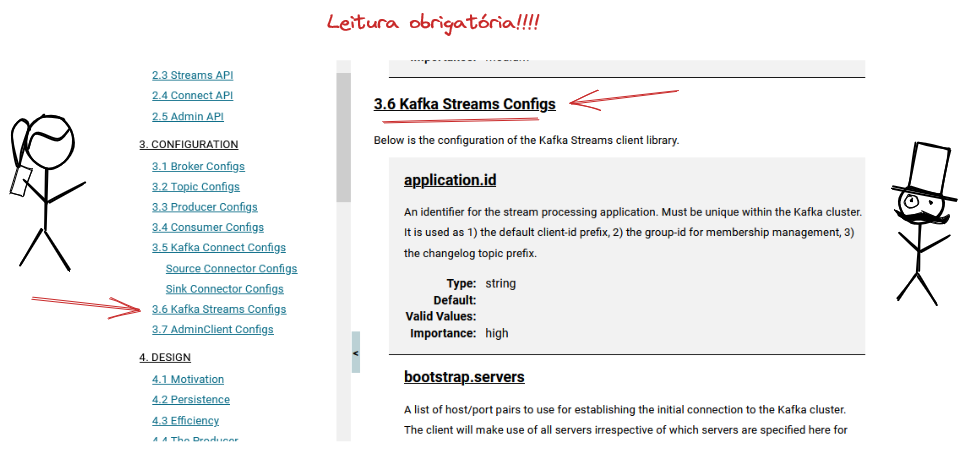

# 5. Como criar um Stream

[Voltar](./04-criando-um-topico.md)


## 5.1. Criando um projeto Java e configurando as bibliotecas necessárias

Streams são diferentes de produtores e consumidores. Enquanto nos produtores e consumidores temos apenas uma biblioteca, o Kafka Stream é mais similar a um framework onde nós inicializamos a topologia do Stream desejado e depois iniciamos o stream. Do lado de quem usa o Stream, não temos controle das operações de **poll** e nem de algumas mensagens enviadas. O Kafka vai tomar a iniciativa de criar alguns tópicos e gerenciar esses tópicos.

Então crie um projeto e adicione a biblioteca `kafka-streams`.

```bash
mvn archetype:generate -DgroupId=io.vepo.kafka.imersao -DartifactId=meu-primeiro-stream -DarchetypeArtifactId=maven-archetype-quickstart -DarchetypeVersion=1.4 -DinteractiveMode=false
```

```xml
<dependency>
    <groupId>org.apache.kafka</groupId>
    <artifactId>kafka-streams</artifactId>
    <version>3.4.0</version>
</dependency>
```

## 5.2. Criando a classe do stream e informando o Maven que ela deve ser executada

Nosso exemplo será um Produtor de informações climáticas, por isso vou criar a classe `WeatherSensorProcessor`, ela vai pertencer ao pacote `io.vepo.sensor.weather`, logo deve ser colocada na estrutura abaixo:

```
.
├── src                      ## Todo o código deve ser armazenado nessa pasta
│   ├── main                 ## Código de produção
|   |   ├── java             ## Código Java de produção
|   |   |   └── io
|   |   |       └── vepo
|   |   |           └── sensor
|   |   |               └── weather
|   |   |                   └── WeatherSensorProcessor.java
|   |   └── resources        ## Arquivos que não serão compilados, mas estarão disponíveis em tempo de execução
│   └── test                 ## Código usado para testes unitários
|       ├── java             ## Código Java para testes unitários
|       └── resources        ## Arquivos que não serão compilados, mas estarão disponíveis em tempo de execução
└── pom.xml                  ## Arquivo que define como será feita a build
```

Criada a classe, podemos verificar se está tudo certo executando ela usando o Maven:

```bash
mvn clean compile exec:java -Dexec.mainClass=io.vepo.sensor.weather.WeatherSensorProcessor
```

Para facilitar nossa vida, vamos adicionar definir a classe principal direto no jar e como configuração padrão para execução.

Adicione o seguinte plugin (procure por `build` → `plugins` ou `build` → `pluginManagement` → `plugins`) para configurar a build:

```xml
<plugin>
    <groupId>org.codehaus.mojo</groupId>
    <artifactId>exec-maven-plugin</artifactId>
    <version>3.1.0</version>
    <configuration>
        <mainClass>io.vepo.sensor.weather.WeatherSensorCollector</mainClass>
    </configuration>
</plugin>
```

Agora para executar, basta usar:

```bash
mvn clean compile exec:java
```

Para definir que essa classe de execução do jar, altere a configuração do plugin `maven-jar-plugin`:

```xml
<plugin>
    <artifactId>maven-jar-plugin</artifactId>
    <version>3.0.2</version>
    <configuration>
        <archive>
            <manifest>
                <addClasspath>true</addClasspath>
                <mainClass>io.vepo.sensor.weather.WeatherSensorProcessor</mainClass>
            </manifest>
        </archive>
    </configuration>
</plugin>
```

Para executar é preciso primeiro criar o jar:

```bash
mvn clean package
java -jar target/meu-primeiro-consumidor-1.0-SNAPSHOT.jar
```

## 5.3. Implementando o Stream

Antes de implementar essa classe, vamos definir alguns pressupostos sobre como ela vai ser utilizada.

1. Todo Stream é inicializado, mas o controle de poll-process-commit é feito pelo código do Kafka.
2. Cabe ao desenvolvedor definir a topologia, as configurações e iniciar o processo.
3. Nossa classe tentará implementar (está incorreto) um filtro de valores, valores de temperatura irreais serão removidos do stream.
4. Para ser possível testar a topologia, a classe será dividida em alguns métodos: `buildTopology` e `start`. `buildTopology` deve ser chamado pelo `start` e será usada para testes, por isso será `package-private`.

```java
try (WeatherSensorProcessor processor = new WeatherSensorProcessor()) {
    processor.start(props);
}
```

### 5.3.1. Implementando os Serdes

Diferentemente dos produtores e dos consumidores um Stream precisa tanto da definição de Serializadores quanto de Deserializadores, para isso surge o conceito de [**Serde**](https://kafka.apache.org/34/javadoc/org/apache/kafka/common/serialization/Serde.html) que é a forma de se definir ambos.

**Serdes** podem ser usados tanto na configuração, onde é obrigado a definir um Serde padrão quanto na topologia. Para conhecer todos os Serdes disponíveis, só ver a classe [**Serdes**](https://kafka.apache.org/34/javadoc/org/apache/kafka/common/serialization/Serdes.html).

As bibliotecas de deserialização vão depender de Schema, que falaremos depois.

Para nosso exemplo, vamos construir um **JsonSerde** somente para exemplificar, no exemplo seria necessário adicionar a relação entre tópico/classe no comentário **TODO**.


```java
public class JsonSerde<T> implements Serde<T> {

    private final ObjectMapper mapper;
    private final Map<String, Class<?>> topicPojoClass;

    public JsonSerde() {
        mapper = new ObjectMapper();
        topicPojoClass = new HashMap<>();
        // TODO: preencher com tópico, classe
    }

    @Override
    public Serializer<T> serializer() {
        return new Serializer<T>() {

            @Override
            public byte[] serialize(String topic, T data) {
                try {
                    return mapper.writeValueAsString(data).getBytes();
                } catch (JsonProcessingException e) {
                    throw new KafkaException("Não foi possível serializar objeto!", e);
                }
            }

        };
    }

    @Override
    public Deserializer<T> deserializer() {
        return new Deserializer<T>() {

            @SuppressWarnings("unchecked")
            @Override
            public T deserialize(String topic, byte[] data) {
                try {
                    return (T) mapper.readValue(data, topicPojoClass.get(topic));
                } catch (IOException e) {
                    throw new KafkaException("Não foi possível deserializar objeto!", e);
                }
            }

        };
    }

}
```

Vamos também criar Serdes para encapsular os serializes/deserializers dos nossos produtores e consumidores.

```java
public class WeatherInfoSerde implements Serde<WeatherInfo> {

    @Override
    public Serializer<WeatherInfo> serializer() {
        return new WeatherInfoSerializer();
    }

    @Override
    public Deserializer<WeatherInfo> deserializer() {
        return new WeatherInfoDeserializer();
    }

}
```

```java
public class GeolocationSerde implements Serde<Geolocation> {

    @Override
    public Serializer<Geolocation> serializer() {
        return new GeolocationSerializer();
    }

    @Override
    public Deserializer<Geolocation> deserializer() {
        return new GeolocationDeserializer();
    }
}
```

### 5.3.2. Definindo as configurações

O próximo passo é definir as configurações do Stream. Quando vamos inicializar qualquer cliente Kafka, ele pode receber como parâmetro um [**Properties**](https://docs.oracle.com/javase/8/docs/api/java/util/Properties.html) ou um **Map<String, Object>** com os valores que serão usados para configurar ao stream e tudo relacionado a ele (serdes, interceptors, etc...). Os valores aceitos como padrão estão na [documentação do site do Kafka](https://kafka.apache.org/documentation/#streamsconfigs), é uma leitura obrigatória.



Abaixo eu listo as configurações mais importantes, mas você não precisa decorar essas chaves, pode usar a classe [**StreamsConfig**](https://kafka.apache.org/34/javadoc/org/apache/kafka/streams/StreamsConfig.html) que além de ter toda as chaves, tem toda a documentação associada a ela.

* `application.id`
* `bootstrap.servers`
* `state.dir`
* `default.deserialization.exception.handler`
* `default.key.serde`
* `default.production.exception.handler`
* `default.value.serde`
* `num.stream.threads`
* `processing.guarantee`

Assim para definir as propriedades que vamos usar basta:

```java
Properties props = new Properties();
props.put(StreamsConfig.BOOTSTRAP_SERVERS_CONFIG, "localhost:9092");
props.put(StreamsConfig.APPLICATION_ID_CONFIG, "weather-sanity");
props.put(StreamsConfig.DEFAULT_KEY_SERDE_CLASS_CONFIG, JsonSerde.class);
props.put(StreamsConfig.DEFAULT_VALUE_SERDE_CLASS_CONFIG, JsonSerde.class);
```

Semelhantemente ao Consumidor, o stream exige que seja definido um ID do Grupo, mas esse ID é chamado de Application ID e não Grup ID. O comportamento do Stream se assemelha ao comportamento do consumidor, não temos apenas um consumidor mas vários.

### 5.3.3. Instanciando e usando o Consumidor

Agora precisamos definir a classe que vai encapsular o stream. As responsabilidades dela serão:

* Iniciar o Stream
* Bloquear o processo enquanto o Stream estiver em atividae

```java
public class WeatherSensorProcessor implements AutoCloseable {

    private static final Logger logger = LoggerFactory.getLogger(WeatherSensorProcessor.class);

    private KafkaStreams streams;
    private CountDownLatch latch;

    public WeatherSensorProcessor() {
        streams = null;
        latch = null;
    }   

    @Override
    public void close() {
        if(Objects.nonNull(streams)) {
            latch.countDown();
            streams.close();
        }
    }

    Topology buildTopology() {
        StreamsBuilder builder = new StreamsBuilder();
        builder.addStateStore(Stores.keyValueStoreBuilder(Stores.persistentKeyValueStore("weather-memory"),
                                                          new GeolocationSerde(),
                                                          new WeatherInfoSerde()))
               .stream("weather", Consumed.with(new GeolocationSerde(), new WeatherInfoSerde()))
               .process(new ProcessorSupplier<Geolocation, WeatherInfo, Geolocation, WeatherInfo>() {

                   @Override
                   public Processor<Geolocation, WeatherInfo, Geolocation, WeatherInfo> get() {
                       return new Processor<Geolocation, WeatherInfo, Geolocation, WeatherInfo>() {
                           private KeyValueStore<Geolocation, WeatherInfo> store;
                           private ProcessorContext<Geolocation, WeatherInfo> context;

                           @Override
                           public void init(ProcessorContext<Geolocation, WeatherInfo> context) {
                               this.context = context;
                               this.store = context.getStateStore("weather-memory");
                           }

                           @Override
                           public void process(Record<Geolocation, WeatherInfo> record) {
                               WeatherInfo previousValue = store.get(record.key());
                               if (Objects.nonNull(previousValue)) {
                                   double deltaTimestamp = (record.timestamp() - previousValue.getTimestamp()) / TimeUnit.MINUTES.toMillis(1);

                                   if (deltaTimestamp > 0.0) {
                                       double deltaTemperatura = previousValue.getTemperature() - record.value().getTemperature();
                                       if (Math.abs(deltaTemperatura) / deltaTimestamp > 1.0) {
                                           logger.warn("[BEFORE] Fixing temperature! delta={}", deltaTemperatura);
                                           deltaTemperatura = (deltaTemperatura > 0 ? 1.0 : -1.0) * deltaTimestamp;
                                           logger.warn("[AFTER ] Fixing temperature! delta={}", deltaTemperatura);
                                       }
    
                                       WeatherInfo stableValue = new WeatherInfo(record.key(),
                                                                                 deltaTemperatura + previousValue.getTemperature(),
                                                                                 record.value().getWind(),
                                                                                 record.value().getTimestamp());
                                       store.put(record.key(), stableValue);
                                       context.forward(record.withValue(stableValue));
                                   } else {
                                       logger.warn("Too close temperature. delta={} ignored={}", deltaTimestamp, record);
                                   }
                               } else {
                                   store.put(record.key(), record.value());
                                   context.forward(record);
                               }
                           }
                       };
                   }

               }, "weather-memory")
               .to("weather-stable");
        return builder.build();
    }

    public void start(Properties props) {
        streams = new KafkaStreams(buildTopology(), props);
        latch = new CountDownLatch(1);

        Runtime.getRuntime().addShutdownHook(new Thread("streams-shutdown-hook") {
            @Override
            public void run() {
                streams.close();
                latch.countDown();
            }
        });

        try {
            streams.start();
            latch.await();
        } catch (InterruptedException e) {
            Thread.currentThread().interrupt();
        }
    }
}
```

Essa classe foi pensada para ser testada também, mas não temos um MockStream e sim o [**TopologyTestDriver**](https://kafka.apache.org/34/javadoc/org/apache/kafka/streams/TopologyTestDriver.html) que testará exclusivamente a topologia.

```java
WeatherSensorProcessor processor = new WeatherSensorProcessor();
Topology topology = processor.buildTopology();

// setup test driver
Properties props = new Properties();
props.put(StreamsConfig.APPLICATION_ID_CONFIG, "test");
props.put(StreamsConfig.BOOTSTRAP_SERVERS_CONFIG, "dummy:1234");
props.put(StreamsConfig.DEFAULT_KEY_SERDE_CLASS_CONFIG, JsonSerde.class);
props.put(StreamsConfig.DEFAULT_VALUE_SERDE_CLASS_CONFIG, JsonSerde.class);
try (TopologyTestDriver testDriver = new TopologyTestDriver(topology, props)) {
    // test
}
```

Outra semelhança entre Stream e Consumidor é que ele acaba herdando toda a lógica de _Heartbeat/Session_, Operação de Rebalanceamento e Commit/Offset/Assignment. Mas nós não temos acesso ao Commit/Offset/Assignment em tempo de execução, sendo ele oferecido como ferramentas que veremos a seguir e como modo de configuração (ver documentação [`processing.guarantee`](https://kafka.apache.org/documentation/#streamsconfigs_processing.guarantee)).

O stream é um framework puramente Kafka, a topologia dele deve ser implementada usando apenas a API disponibilizada pela biblioteca `kafka-streams`. Ao se criar uma topologia Stream, é iniciado com uma classe [**KStream**](https://kafka.apache.org/34/javadoc/org/apache/kafka/streams/kstream/KStream.html) pelo qual podemos construir a topologia usando uma API.

Não é recomendado usar APIs bloqueantes ao construir uma topologia, se isso for feito haverá um impacto no Heartbeat o que pode iniciar uma operação de Operação de Rebalanceamento (_Rebalancing_). 

Caso haja a necessidade de se implementar com uma API bloqueante (API REST, RPC, etc...) é recomendado que se direcione o Stream para um tópico e se crie Sink Connector.

### 5.3.4. Topologia - KStream API

Ao se criar um Stream, primeiro deve se definir a topologia que é definida a partir da classe [**StreamsBuilder**](https://kafka.apache.org/34/javadoc/org/apache/kafka/streams/StreamsBuilder.html). Dessa classe vamos focar no método [**stream**](https://kafka.apache.org/34/javadoc/org/apache/kafka/streams/StreamsBuilder.html#stream(java.lang.String)) que criará uma DSL para gerar o Stream.

Um Stream é definido a partir de um tópico e os Serdes para chave e valor podem ser especificados. Foi assim que iniciamos o nosso exemplo.

```java
builder.stream("weather", Consumed.with(new GeolocationSerde(), new WeatherInfoSerde()))
```

Com essa chamada temos acesso a classe [**KStream**](https://kafka.apache.org/34/javadoc/org/apache/kafka/streams/kstream/KStream.html). É muito importante conhecer essa classe, vou aqui citar alguns métodos importantes:

* `filter`
* `branch`
* `forEach`
* `groupBy`
* `mapValues`
* `process`
* `to`

É importante conhecer a documentação desse método, alguns são simples como `filter`, `branch`, `mapValues` e `forEach`, mas outros são mais complicados como o `groupBy` e `process`. O método `groupBy` não vai ser explorado aqui, apenas o `process` porque ele cria um contexto.

Quando a alteração precisar de contexto, esse deve ser feito através do `process`, ele pode filtar valores ou adicionar novos valores ao Stream. Nós implementamos um `process` no nosso exemplo onde o valor é alterado de acordo com o valor anterior armazenado em um _State Store_.

O exemplo abaixo não foi feito usando Lambdas para que os tipos ficasse expostos, nós precisamos implementar as classes [**ProcessorSupplier**](https://kafka.apache.org/34/javadoc/org/apache/kafka/streams/processor/api/ProcessorSupplier.html) e [**Processor**](https://kafka.apache.org/34/javadoc/org/apache/kafka/streams/processor/api/Processor.html). A classe **ProcessorSupplier** serve apenas para fornecer uma instância do **Processor** e pode ser substituido por uma expressão lambda, mas o **Processor** não pode ser.

Os pontos que quero ressaltar no **Processor** é a inicialização que se devem ser salvos todos os _State Stores_ e o [**ProcessorContext**](https://kafka.apache.org/34/javadoc/org/apache/kafka/streams/processor/api/ProcessorContext.html). O **ProcessorContext** deve ser usado para se enviar um recurso para o próximo estágio do Stream. E os _States Stores_ veremos mais a seguir.

```java
.process(new ProcessorSupplier<Geolocation, WeatherInfo, Geolocation, WeatherInfo>() {
    @Override
    public Processor<Geolocation, WeatherInfo, Geolocation, WeatherInfo> get() {
        return new Processor<Geolocation, WeatherInfo, Geolocation, WeatherInfo>() {
            private KeyValueStore<Geolocation, WeatherInfo> store;
            private ProcessorContext<Geolocation, WeatherInfo> context;

            @Override
            public void init(ProcessorContext<Geolocation, WeatherInfo> context) {
                this.context = context;
                this.store = context.getStateStore("weather-memory");
            }

            @Override
            public void process(Record<Geolocation, WeatherInfo> record) {
                WeatherInfo previousValue = store.get(record.key());
                if (Objects.nonNull(previousValue)) {
                    double deltaTimestamp = (record.timestamp() - previousValue.getTimestamp()) / TimeUnit.MINUTES.toMillis(1);

                    if (deltaTimestamp > 0.0) {
                        double deltaTemperatura = previousValue.getTemperature() - record.value().getTemperature();
                        if (Math.abs(deltaTemperatura) / deltaTimestamp > 1.0) {
                            logger.warn("[BEFORE] Fixing temperature! delta={}", deltaTemperatura);
                            deltaTemperatura = (deltaTemperatura > 0 ? 1.0 : -1.0) * deltaTimestamp;
                            logger.warn("[AFTER ] Fixing temperature! delta={}", deltaTemperatura);
                        }

                        WeatherInfo stableValue = new WeatherInfo(record.key(),
                                                                    deltaTemperatura + previousValue.getTemperature(),
                                                                    record.value().getWind(),
                                                                    record.value().getTimestamp());
                        store.put(record.key(), stableValue);
                        context.forward(record.withValue(stableValue));
                    } else {
                        logger.warn("Too close temperature. delta={} ignored={}", deltaTimestamp, record);
                    }
                } else {
                    store.put(record.key(), record.value());
                    context.forward(record);
                }
            }
        };
    }

}, "weather-memory")
```

### 5.3.5. _State Stores_

_State Store_ são tópicos especiais que podem ser usados para armazenar dados que serão usados em Streams. Um state store pode ser Global ou Local, ao se adicionar um registro em um _Global State Store_ ele estará disponível a todas as instâncias e todas as threads do Stream. Já ao se adicionar um registro a um _Local State Store_ ele estará disponível somente para a partição/thread em execução.

O ponto chave aqui é que cada thread será responsável por uma ou mais partição, isso implica que registros de uma mesma partição serão processados pela mesma thread.

[Voltar](./04-criando-um-topico.md)